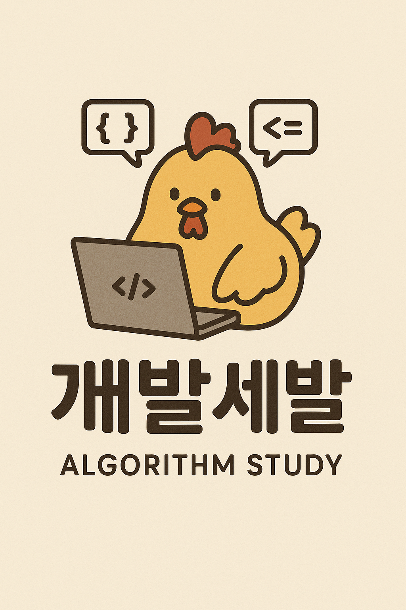

# 🚀 개발세발 알고리즘 스터디

### 💪 효율적인 진행과 꾸준한 학습을 위한 개발세발 스터디

## 👨‍💻 Team Members

<table>
  <tr>
    <td align="center">
      
       
      <b>민</b>
    </td>
    <td align="center">
      
       
      <b>jsun</b>
    </td>
    <td align="center">
      
       
      <b>xxx</b>
    </td>
  </tr>
</table>

---

## 🤝 스터디 공지!

> **규칙은 모두의 즐거운 학습을 위한 최소한의 약속입니다.**  
> **서로의 일정과 상황을 존중하며, 유연하고 책임감 있게 운영해 나가요!**

---

## 📋 목차

- [📚 규칙 1: 문제 풀이 진행 방식](#-규칙-1-문제-풀이-진행-방식)
- [💰 규칙 2: 스터디 벌금 및 통장](#-규칙-2-스터디-벌금-및-통장)
- [👥 규칙 3: 주간 모임 운영](#-규칙-3-주간-모임-운영)
- [🍕 규칙 4: 월말 오프라인 모임](#-규칙-4-월말-오프라인-모임)
- [📢 규칙 5: 불참 통보 및 예외 기준](#-규칙-5-불참-통보-및-예외-기준)
- [⚡ 규칙 6: 중복 위반 시 벌금 증가](#-규칙-6-중복-위반-시-벌금-증가)

---

## 📚 규칙 1: 문제 풀이 진행 방식

### 🎯 기본 원칙
- **Baekjoon CLASS 문제**를 순차적으로 풉니다
- 진도표는 매주 **일요일 미팅 후 '함께' 결정**합니다
- ⚠️ **미팅 불참 시** 참석한 두 명이 결정할 수 있습니다

### 📊 전체 진행 계획 (2개월 기준)

| CLASS | 문제 수 | 일일 목표 | 예상 소요기간 | 비고 |
|-------|---------|-----------|---------------|------|
| **CLASS 1** | 16문제 (에센셜) | 자율 | 1주 내 완료 (~6/22까지) | 🟢 기초 다지기 |
| **CLASS 2** | 20문제 (에센셜) | 5문제/일 | ~6/29까지 | 🔵 본격 시작 |
| **CLASS 3** | 48문제 + 에센셜 20문제 | 2문제/일 | 약 24일 | 🟡 중급 도전 |
| **CLASS 4** | 48문제 + 에센셜 24문제 | 2문제/일 | 약 24일 | 🔴 고급 정복 |

#### 🗓️ 타임라인
- **7/1 ~ 8/31**: CLASS 3~4 진행 (D+61일) *여유롭게 추가 기간 잡아놓음*
- **9/1부터**: CLASS 5 또는 골드/기출문제(예: 카카오, 삼성 기출 등)로 진행 예정

---

## 💰 규칙 2: 스터디 벌금 및 통장

### 🏦 벌금 시스템
- 스터디 모임통장에 규칙 미준수시 **월 1만원씩 납부**
    - **jsun이 총무 담당**
- 💡 **용도**: 월말 오프라인 모임(식사 등) 비용으로 사용

### 💸 벌금 규칙 기준
- **매주 정해진 문제 수 미달 시**: 1만원 벌금
- **기준 시각**: 일요일 18:00까지 GitHub 커밋 필수 ⏰

---

## 👥 규칙 3: 주간 모임 운영

### 🕐 모임 시간
**매주 일요일 20:00**

### 📝 진행 항목
1. **각자 어려웠던 문제 1개 공유** (총 3문제)
2. **랜덤 선택(사다리타기)으로 1~2문제 설명**
   - 본인의 풀이 방식 리뷰
   - 타인의 풀이 방식과 비교
3. **이외 추가적으로 공유하고 싶은 문제는 자유롭게 공유 가능**

---

## 🍕 규칙 4: 월말 오프라인 모임

### 🎲 구성
- **매달 말에 꼭 1회** 오프라인 모임 진행
- **사다리타기 방식**으로 백준 문제 2개 선정 후 오프라인 코딩테스트 진행
    - **[1시간 이내 코딩 테스트 진행 (30분 + 30분)]**
- 이후 **식사 및 자유시간** (술 포함 가능) 🍻

---

## 📢 규칙 5: 불참 통보 및 예외 기준

### ⏰ 불참 통보
- 개인 일정으로 불참 시 최소 **'2일 전' 통보**
- **예**: 금요일 자정까지(00시까지)
- **미통보 시**: 벌금 1만원

### 🛡️ 예외 인정 범위

#### 💛 벌금 5천원 (반액)
- 일요일만 일정 가능한 친구 약속으로 인한 불참 등
- 양심적인 개인 사정 다 가능 (**단, 사전 통보 必**)

#### 💚 벌금 면제
- **집안 사정**
- **취업 관련 일정** (면접, 자소서 제출 등)
- **과반수 동의 시**
- **어떠한 사유로든 상관없이 2일전 통보시** (술 약속 힘들어서 등등 다 가능 단, 2일전 통보시)

---

## ⚡ 규칙 6: 중복 위반 시 벌금 증가

### 💥 중복 위반
- **규칙 2 + 규칙 5 위반 시** 벌금은 총 **2만원**
- **예**: 문제 미제출 + 무단 불참 시

### 🎉 특별 예외
- **어떠한 사유로든 상관없이 2일전 통보 후 미팅 참석이 어려운 경우**
    - **2일 전 사전 고지 + 커밋 완료 시** 불참 인정 (**벌금 없음**)

---

## 🤝 스터디 공지!

> **규칙은 모두의 즐거운 학습을 위한 최소한의 약속입니다.**  
> **서로의 일정과 상황을 존중하며, 유연하고 책임감 있게 운영해 나가요!**

---

### 🔥 Let's Code Together! 🔥

**Made with ❤️ by 개발세발 Team**

