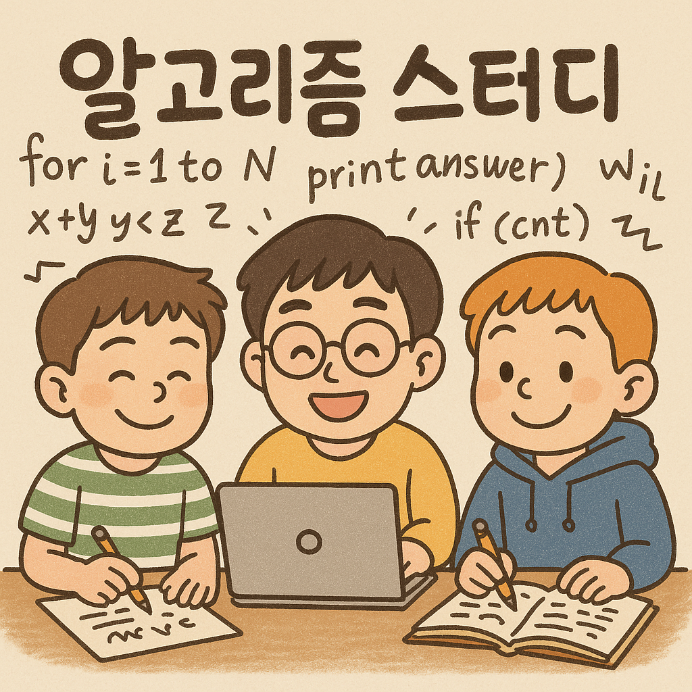

# 🚀 개발새발 알고리즘 스터디

<div align="center">


### 💪 효율적인 진행과 꾸준한 학습을 위한 개발새발 스터디

## 👨‍💻 Team Members

<table>
  <tr>
    <td align="center">
      
      <br/>
      <b>민</b>
    </td>
    <td align="center">
      
      <br/>
      <b>JSun</b>
    </td>
    <td align="center">
      
      <br/>
      <b>도영</b>
    </td>
  </tr>
</table>

</div>

---

<div align="center">

## 🤝 스터디 공지!

> **규칙은 모두의 즐거운 학습을 위한 최소한의 약속입니다.**  
> **서로의 일정과 상황을 존중하며, 유연하고 책임감 있게 운영해 나가요!**

</div>

---

## 📋 목차

- [📝 규칙 0: 커밋 컨벤션](#-규칙-0-커밋-컨벤션)
- [📚 규칙 1: 문제 풀이 진행 방식](#-규칙-1-문제-풀이-진행-방식)
- [👥 규칙 2: 주간 모임 운영](#-규칙-2-주간-모임-운영)
- [🍕 규칙 3: 월말 오프라인 모임](#-규칙-3-월말-오프라인-모임)
- [📢 규칙 4: 불참 통보 및 예외 기준](#-규칙-4-불참-통보-및-예외-기준)

---

## 📝 규칙 0: 커밋 컨벤션

### 🎯 기본 커밋 컨벤션
```
solve: 문제번호 - 문제 제목
```

### 📁 파일명(클래스 이름) 컨벤션
```
Q_문제번호_티어_소요시간
```

### 📌 커밋 메시지 예시
- `solve: 1000 - A+B`
- `solve: 2798 - 블랙잭`

### 📌 파일명 예시
- `Q_1001_B5_104ms`
- `Q_2675_B2_92ms`

### 🔧 기타 컨벤션
- `refactor: 문제번호 - 개선내용` (코드 리팩토링)
- `fix: 문제번호 - 수정내용` (버그 수정)
- `docs: 내용` (문서 작성/수정)
- `chore: 내용` (폴더 구조 등 기타 작업)

---

## 📚 규칙 1: 문제 풀이 진행 방식

### 🎯 기본 원칙
- **Baekjoon CLASS 문제**를 순차적으로 풉니다
- 진도표는 매주 **일요일 미팅 후 '함께' 결정**합니다
- ⚠️ **미팅 불참 시** 참석한 두 명이 결정할 수 있습니다

### 📊 전체 진행 계획 (2개월 기준)

| CLASS | 문제 수 | 일일 목표 | 예상 소요기간 | 비고 |
|-------|---------|-----------|---------------|------|
| ~~**CLASS 1**~~ | ~~16문제 (에센셜)~~ | ~~자율~~ | ~~1주 내 완료 (6/22까지)~~ | ~~🟢 기초 다지기~~ |
| ~~**CLASS 2**~~ | ~~20문제 (에센셜)~~ | ~~5문제/일~~ | ~~6/29까지~~ | ~~🔵 본격 시작~~ |
| **25.06.30 ~ 25.07.06** | [무지의 먹방 라이브 풀이](https://school.programmers.co.kr/learn/courses/30/lessons/42891) | 1문제 / 주 | 7/6까지 | 🟡 기출 진행 |

#### 🗓️ 타임라인
- **25.06.30 ~ 25.07.06**: [무지의 먹방 라이브 풀이 해오기](https://school.programmers.co.kr/learn/courses/30/lessons/42891)
- **7/28**: 오프라인 미팅 예정 

---

## 👥 규칙 2: 주간 모임 운영

### 🕐 모임 시간
**매주 일요일 20:00**

---


## 🍕 규칙 3: 월말 오프라인 모임
- **7/28**: 오프라인 미팅 예정 
    - **[1시간 이내 코딩 테스트 진행 (30분 + 30분)]**

- 이후 **식사 및 자유시간** (술 포함 가능) 🍻

---

## 📢 규칙 4: 불참 통보 및 예외 기준

### ⏰ 불참 통보
- 개인 일정으로 불참 시 최소 **'2일 전' 통보** 부탁드려요.
  - 개인사유 모두 인정합니다!
  - 단, 서로의 일정을 존중해주세요! 꼭!! 미리 **통보** 해주세요!

---
<br>

<div align="center">

### 🔥 Let's Code Together! 🔥



**Made with ❤️ by 개발새발 Team**

</div>
